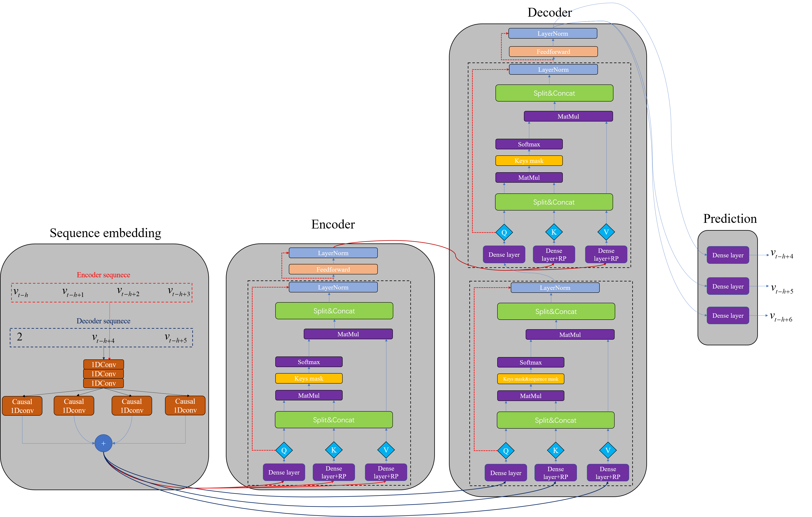
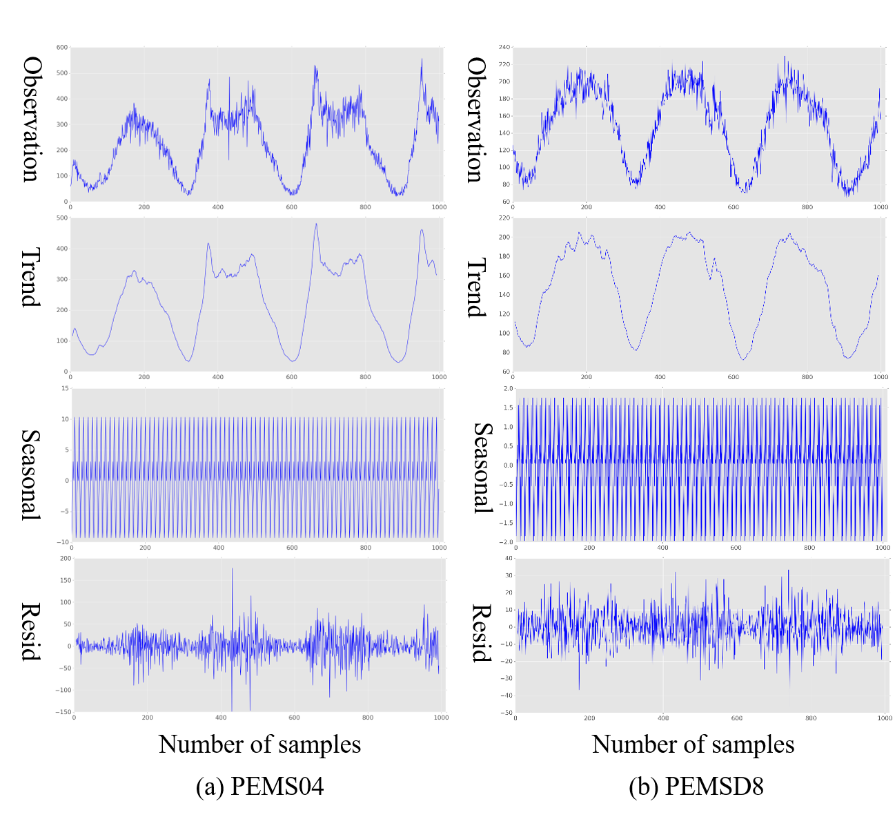
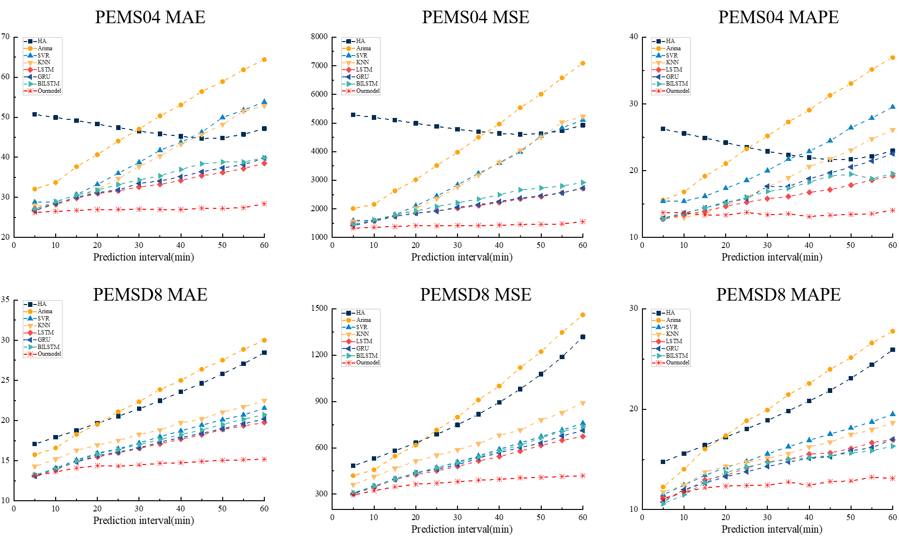
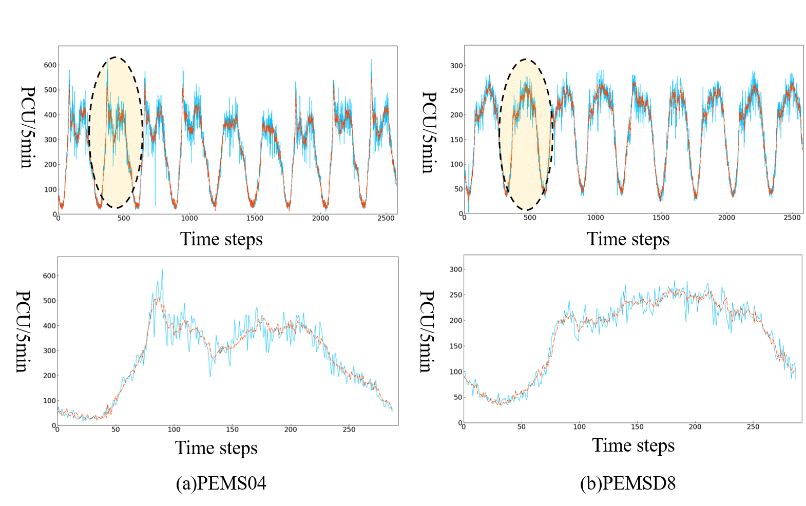
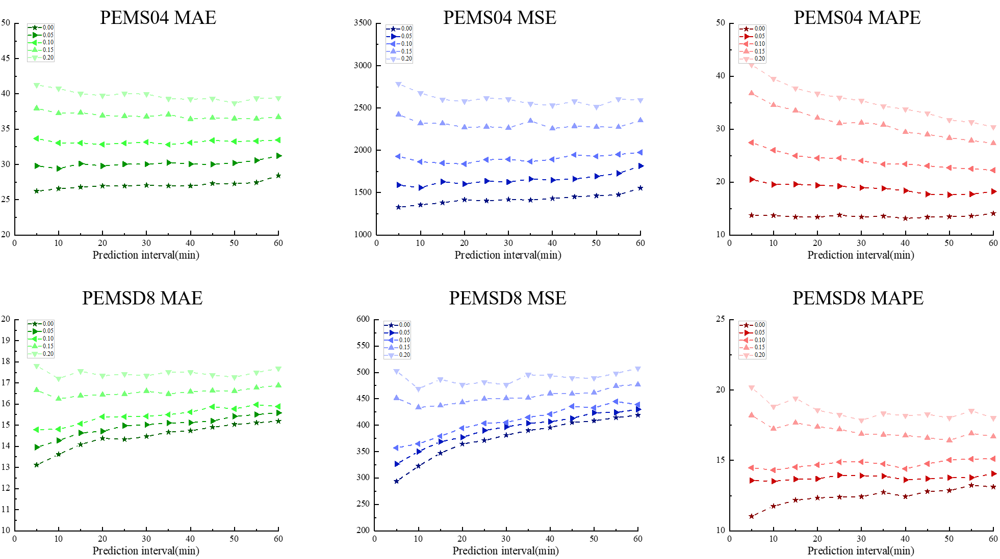

# RPConvformer
Improved Transformer based on Tensoflow implementation for traffic flow predictive modeling


## Contents

- [Background](#background)
- [Preliminary](#preliminary)
	- [Dataset](#dataset)
	- [Weight](#weight)
- [Training](#training)
- [Testing](#testing)
- [Results](#results)
- [Contributing](#contributing)
- [License](#license)

## Background

  Accurate prediction of traffic flow can significantly improve the operational efficiency of traffic.
  Previous modeling models of the timing of traffic flow have the problems of inability to parallelize processing sequence nodes, inability to expand the fixation of input sequences, and insufficient interpretability. 
  Thus, we propose a novel framework called RPConvformer to solve the above problems, and it is an improved structure of the transformer. 
  Specifically, RPConvformer has an encoding-decoding structure, in the sequence embedding module we adopt causal 1Dconvolution for capturing the local correlation of time series, the encoder module is responsible for encoding historical traffic flow information,
  and information of any length of input sequence can be processed via the key mask (KME), and the decoder autoregressively predicts the future traffic state. 
  RPConvformer has three attention modules, which are divided into input sequence self-attention, output sequence self-attention, and input-output interactive-attention. They all have multiple headers, and the calculation method is scaled dot-product attention (SDPA) In addition, when calculating the attention score, we introduce the relative position bias to consider the relative position information of the internal nodes in the sequence. The calculated attention score matrix is interpretable.
  Extensive experiments on two real-world traffic flow datasets demonstrate the superiority of our model over several state-of-art methods.
## Preliminary
Before entering this project, you may need to configure the environment based on `Tensorflow2.x-gpu`.

### Dataset

Before training, please run the [data_store.py](data_store.py) to generate PEMS04 and PEMSD8 data files respectively.pkl.
Moreover, if you want to change something, you can change the hyperparameters in [Hyperparameter.py](Hyperparameter.py) (Line 16& Line17), and you also
can change the [data_store.py](data_store.py)(Line 67& Line 68), the second parameters for different links and the third parameters for different traffic features,
such as flow, occupy, and speed.

### Weight
We have trained a model for PEMS04 and PEMD8, You can download the weight of the traffic flow prediction model from 
```
https://drive.google.com/drive/folders/1-_66IvjOCkkDUquVEqbJ4FaOZPKi1uw6?usp=sharing
```
Three folders: `ckpt_pems04new`(trained for PEMS04),`ckpt_pems08new`(trained for PEMSD8),`logdir`(running record).When you want to test the PEMS04 testing datasets.
please copy the files in `ckpt_pems04new` to a brand new folder named `ckpt`, the same operation as the PEMSD8. In addtion, if you want to see the runningr record.
you can open the terminal and run the following statement:
```
cd RPConvformer
tensorboard --logdir=logdir
```
and then copy the  the address to open in Google Chrome.However，sometimes you may be failure to open it, just relax, and close network connection.,replay it.


## Training
The backbone RPconvformer


The [moudels.py](moudels.py) and [framework.py](framework.py) are the most important componets in this project. Moerover, You can come up with some innovative and great ideas and you can also can change the hyperparmetes in the [Hyperparameter.py](Hyperparameter.py) if you like .So you can finally train the network by running the following command:
```
python train.py
```
You will get a new file of your own trained weights saved in `ckpt` folders.Don't worry about getting an error, even if there are weight files in the folder, they will be overwritten during training.


## Testing 

After a long and hard training, you will get a good traffic flow prediction model,please try to run the [test.py], 

You need to pay attention that the model takes up a lot of video memory, so there is no need to feed too much data at one time, please modify line30 and line31 according to the configuration.

In the end, several `xlsx` files will be generated under the project. You can use a clumsy method to splicing them in `excel` like me, or you can write an automatic splicing program based on `pandas` for splicing.

If you want more information, copy the concatenated table under [Baselinemodel](Baselinemodel) and run the following:
```
python visual_transformer.py
```
We provide three evaluation metrics, MAE, MSE, and MAPE, 
which are evaluated on multi-step predictions, 
and the evaluations of our model and the baseline model are saved in 
[Baselinemodel/each_step_metrics_pems04](Baselinemodel/each_step_metrics_pems04) and [Baselinemodel/each_step_metrics_pems08](Baselinemodel/each_step_metrics_pems08).

## Results
Some visualization results as follow:


**Data anlysis**




**comparsion on different methods**



**visual flow**




**random mask**




## Contributing

Most of the code comes from [Kyubyong/transformer](https://github.com/Kyubyong/transformer))

The inspiration of this article comes from these [paper]([https://arxiv.org/abs/1707.06484](https://arxiv.org/abs/1907.00235)) and [paper](https://arxiv.org/abs/1803.02155)


At last, thank you very much for the contribution of the co-author in the article, and also thank my girlfriend for giving me the courage to pursue for a Ph.d.

## License

[MIT](LICENSE) © YanjieWen

